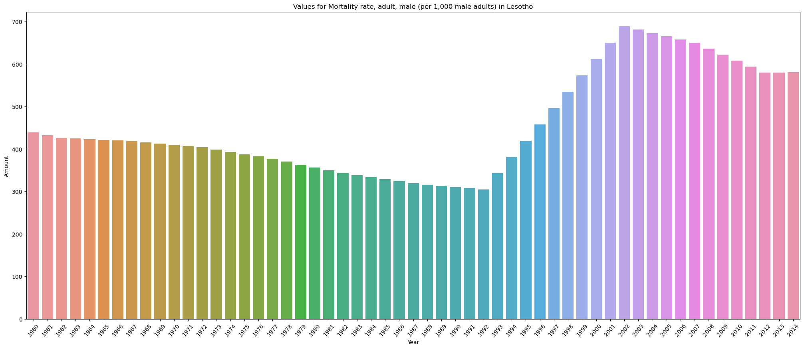
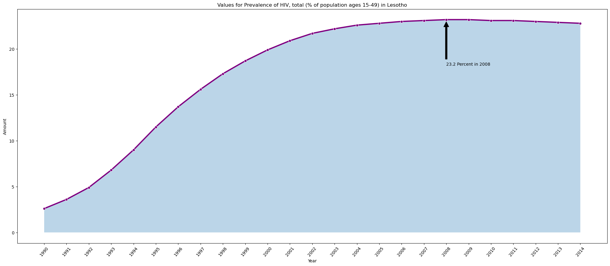
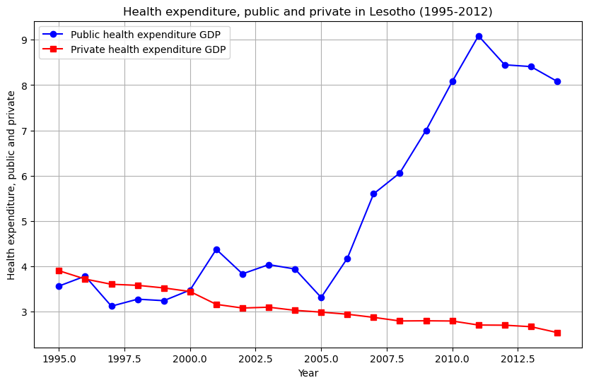
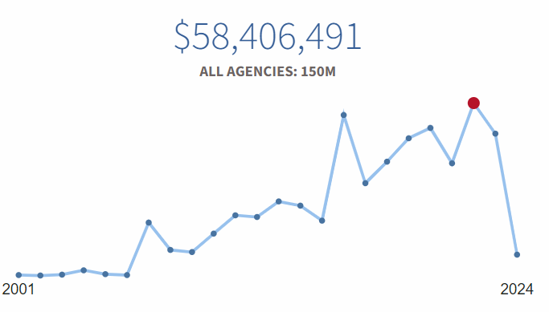
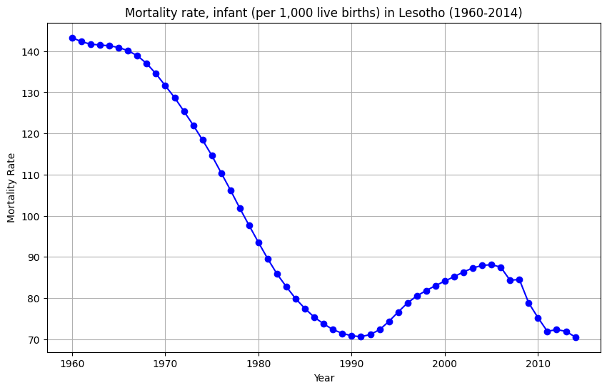
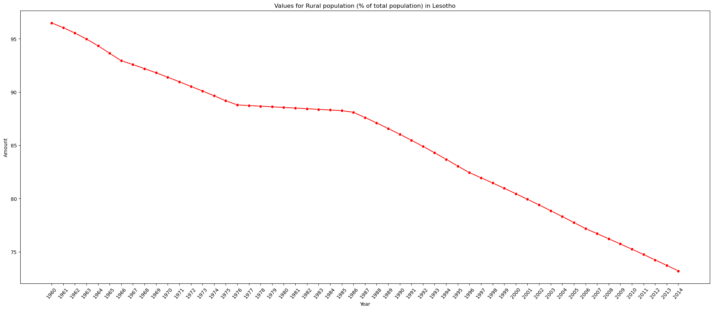
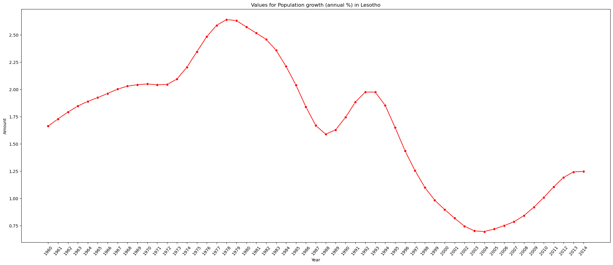

# Lesotho, Mortality and Recovery  

## Unrest in the 90's

A look at the healthcare statistics for Lesotho shows a dramatic picture in the 1990's, with mortality rates showing a sudden rise starting in 1994 and peaking in 2002. Political upheaval is undoubtedly a major factor in this turn of events for the small, Southern African country, as it sought to transition from military rule in the 1980's to a constitutional form of government. With the return of King Moshoeshoe II in 1992. It wasn't until 1995 that King Moshoeshoe II regained his throne, but he died a year later and his son took power. It was precisely during this time that an alarming mortality rate began to show itself. We can see the peak in 2002, with only 300 out of 1000 adult males surviving that year.

## Struggles in the New Millenia
Unfortunately, Losotho has still not recovered completely. This can be due to a myraid of factors. In 2007, Lesotho experienced one of its worst droughts in 30 years, another coup attempt against King Letsie III in 2014, and various corruption scandals. While Lesotho contributes a great deal of its GDP towards education, it has the second most number of cases of HIV in Africa (this peaked at 23.3% of the population in 2008 and 2009).

We can see a shift in effort towards healthcare during these years, as well. The graph below, shows a focus on public healthcare starting in 2005 and peaking around 2011 at just over 9 percent of the country's GDP going towards public health expenses.

## Foreign Aid

After the drought of 2007, we see an uptick in foreign aid, with the UN calling for aid to assist with the country's ongoing needs. This has continued, since then, primarily to address the HIV crisis, and peaking in 2022 with 58.4 million in foreign aid. While this is well below the average for foreign aid in Africa (320M), Lesotho is a small country, by comparison.

## Recovery

The picture isn't entirely bleak in Lesotho. All of these efforts have seen some success. We can see in the graph below that infant mortality rates have seen a significant drop. In 1960, largely due to a lack of urbanization, the mortality rate is at its highest with over 140 deaths per 1,000 births. This drops, following Lesotho independence, but spikes again during the turmoil of the 1990's. After 2007, when we saw a spike in foreign aid, these rates begin to decline again and are now at an all time low.

One thing that has been consistent since 1960, is the decline of Lesotho's rural population. In 1960 we see it at nearly 100%, and at nearly 70 percent in 2014. The below graph illustrates this and is indicative of Lesotho's efforts to become a developed nation.

The below graph shows the population growth after independence, then the decline in the 1980's, with another uptick during relative stability after the military coupe in 1986. The next severe decline coincides with the political turmoil of the 1990's, but we see an optimistic return following this. Hopefully, for Lesotho, this is inidicative of recovery.

